<h2>Tensorflow-Image-Segmentation-Triple-Negative-Breast-Cancer (2024/06/14)</h2>

This is an experimental Image Segmentation project for Triple-Negative Breast Cancer (TNBC) based on
the <a href="https://github.com/sarah-antillia/Tensorflow-Image-Segmentation-API">Tensorflow-Image-Segmentation-API</a>, and
TNBC-ImageMask-Dataset 
<a href="https://drive.google.com/file/d/1sR4BxykMBy0KkhmmUIx89yBAU-es-FSl/view?usp=sharing">TNBC-ImageMask-Dataset-V1.zip</a>
, which was derived by us from the dataset of <a href="https://zenodo.org/records/2579118"><b>Segmentation of Nuclei in Histopathology Images by deep regression of the distance map</b></a> using an offline-augmentation tool.
  
Please see also <a href="https://paperswithcode.com/dataset/tnbc">TNBC dataset</a>
  

On the <b>TNBC-ImageMask-Dataset</b>, please refer to our repository<a href="https://github.com/sarah-antillia/ImageMask-Dataset-Triple-Negative-Breast-Cancer">
ImageMask-Dataset-Triple-Negative-Breast-Cancer</a> 

<b>Actual Image Segmentation Examples.</b> 
As shown below, the first example was almost successful, but the second one failed. 
The U-Net segmentation model trained on our ImageMask Dataset failed to accurately predict most of the cancer cells. 
This could be due to limitations of the U-Net model itself or the quality of the ImageMask Dataset. 
Further investigation is needed to determine the root cause and identify potential solutions, such as employing 
a more advanced U-Net model or enhancing the ImageMask Dataset.
   
<table>
<tr>
<th>Input: image</th>
<th>Mask (ground_truth)</th>
<th>Prediction: inferred_mask</th>
</tr>
<tr>
<td>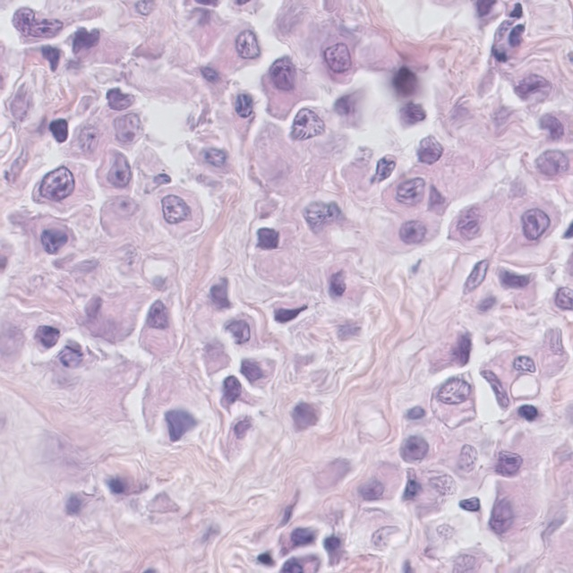</td>

<td>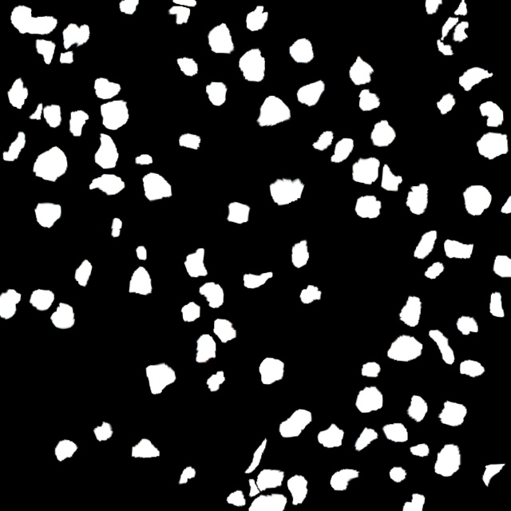</td>
<td>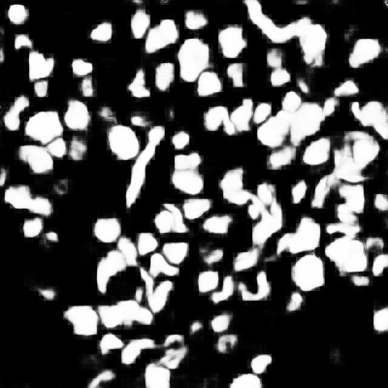</td>
</tr>

<tr>
<td>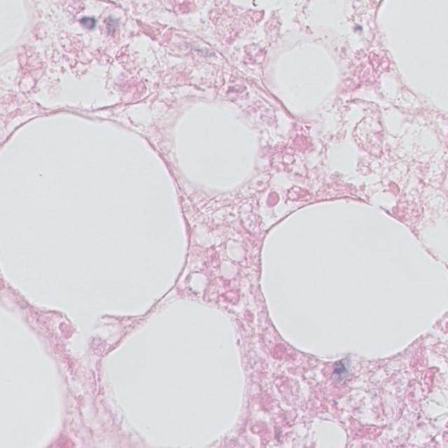</td>

<td>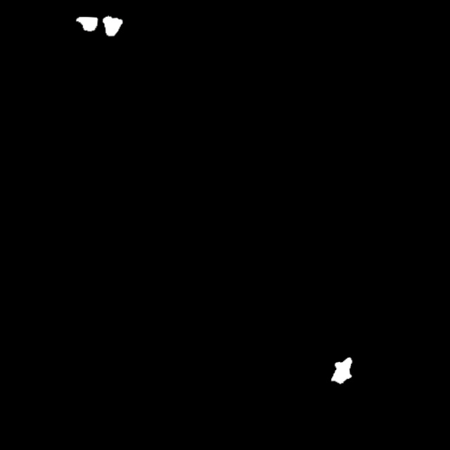</td>
<td>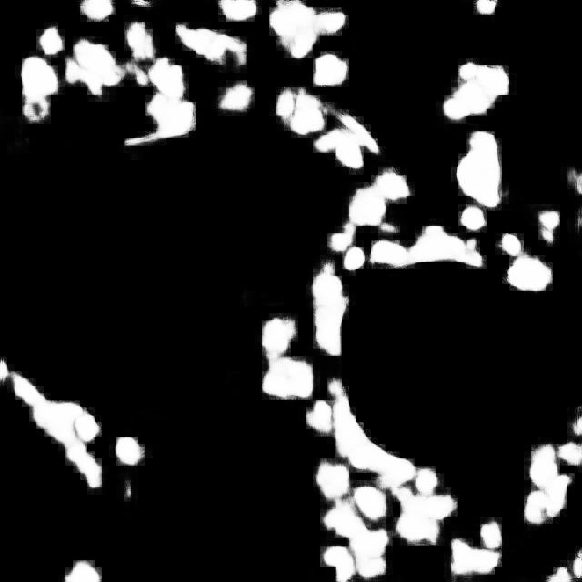</td>
</tr>
</table>

 
In this experiment, we used the simple UNet Model 
<a href="./src/TensorflowUNet.py">TensorflowSlightlyFlexibleUNet</a> for this Breast Cancer Segmentation. 
As shown in <a href="https://github.com/sarah-antillia/Tensorflow-Image-Segmentation-API">Tensorflow-Image-Segmentation-API</a>.
you may try other Tensorflow UNet Models: 
 
<li><a href="./src/TensorflowSwinUNet.py">TensorflowSwinUNet.py</a></li>
<li><a href="./src/TensorflowMultiResUNet.py">TensorflowMultiResUNet.py</a></li>
<li><a href="./src/TensorflowAttentionUNet.py">TensorflowAttentionUNet.py</a></li>
<li><a href="./src/TensorflowEfficientUNet.py">TensorflowEfficientUNet.py</a></li>
<li><a href="./src/TensorflowUNet3Plus.py">TensorflowUNet3Plus.py</a></li>
<li><a href="./src/TensorflowDeepLabV3Plus.py">TensorflowDeepLabV3Plus.py</a></li>

 

<h3>1. Dataset Citation</h3>
The original dataset used here has been taken from the following web site. 
<a href="https://zenodo.org/records/2579118"><b>Segmentation of Nuclei in Histopathology Images by deep regression of the distance map</b></a>
 
Published February 16, 2018 | Version 1.1 

<b>Creators</b> 
Naylor Peter Jack,Walter Thomas, Laé Marick, Reyal Fabien 

<b>Description</b> 
This dataset has been annonced in our accepted paper "Segmentation of Nuclei in Histopathology Images  
by deep regression of the distance map" in Transcation on Medical Imaging on the 13th of August. 
This dataset consists of 50 annotated images, divided into 11 patients. 
 
 
v1.1 (27/02/19): Small corrections to a few pixel that were labelled nuclei but weren't. 
 

<h3>
<a id="2">
2 TNBC (Breast Cell) ImageMask Dataset
</a>
</h3>
 If you would like to train this TNBC Segmentation model by yourself,
 please download the dataset from the google drive  
<a href="https://drive.google.com/file/d/1sR4BxykMBy0KkhmmUIx89yBAU-es-FSl/view?usp=sharing">TNBC-ImageMask-Dataset-V1.zip</a>
 
 
Please expand the downloaded ImageMaskDataset and place them under <b>./dataset</b> folder to be
<pre>
./dataset
└─TNBC
    ├─test
    │   ├─images
    │   └─masks
    ├─train
    │   ├─images
    │   └─masks
    └─valid
        ├─images
        └─masks
</pre>
 

<b>TNBC Dataset Statistics</b> 
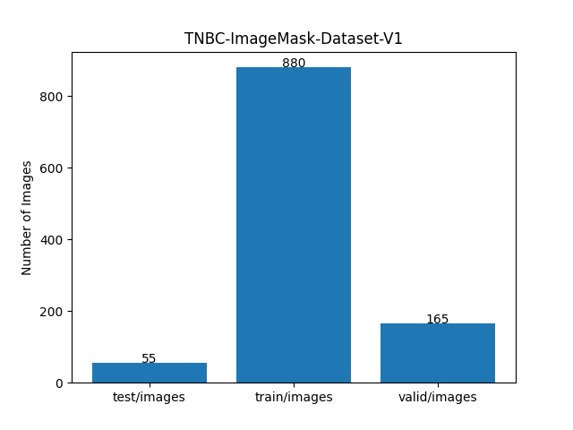 
 
As shown above, the number of images of train and valid dataset is not necessarily large. 
 

 
<b>Train_images_sample</b> 
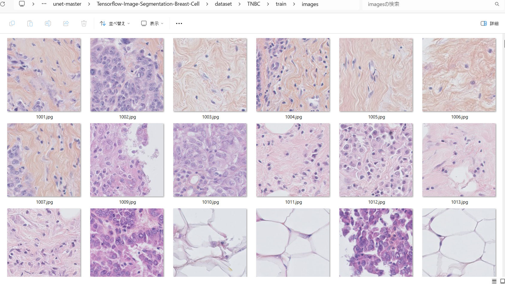
 
<b>Train_masks_sample</b> 
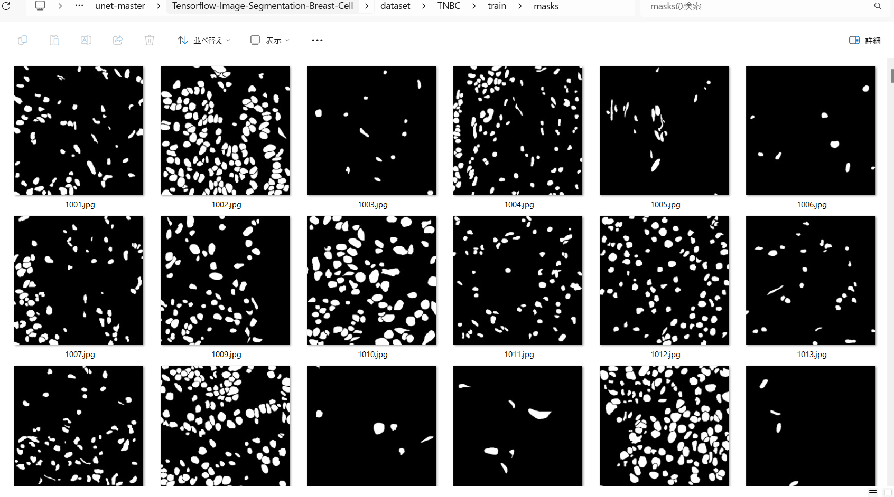
 

<h3>
4 Train TensorflowUNet Model
</h3>
 We have trained TNBC TensorflowUNet Model by using the following
<a href="./projects/TensorflowSlightlyFlexibleUNet/TNBC/train_eval_infer.config"> <b>train_eval_infer.config</b></a> file.  
Please move to ./projects/TNBC and run the following bat file: 
<pre>
>1.train.bat
</pre>
, which simply runs the following command. 
<pre>
>python ../../../src/TensorflowUNetTrainer.py ./train_eval_infer.config
</pre>
<pre>
; train_eval_infer.config
; 2024/06/13 (C) antillia.com

[model]
model          = "TensorflowUNet"
generator      = False
image_width    = 640
image_height   = 640
image_channels = 3
input_normalize = False
num_classes    = 1
normalization  = False
base_filters   = 16
base_kernels   = (5,5)
num_layers     = 7
dropout_rate   = 0.05
learning_rate  = 0.0001
clipvalue      = 0.3
dilation       = (1,1)
loss           = "bce_dice_loss"
metrics        = ["binary_accuracy"]
show_summary   = False

[train]
epochs        = 100
batch_size    = 2
patience      = 10
;metrics       = ["iou_coef", "val_iou_coef"]
metrics       = ["binary_accuracy", "val_binary_accuracy"]
model_dir     = "./models"
eval_dir      = "./eval"
image_datapath = "../../../dataset/TNBC/train/images/"
mask_datapath  = "../../../dataset/TNBC/train/masks/"
create_backup  = False
learning_rate_reducer = True
reducer_factor        = 0.2
reducer_patience      = 4
save_weights_only     = True

;Inference execution flag on epoch_changed
epoch_change_infer     = True

; Output dir to save the infered masks on epoch_changed
epoch_change_infer_dir =  "./epoch_change_infer"

;Tiled-inference execution flag on epoch_changed
epoch_change_tiledinfer     =False

; The number of the images to be inferred on epoch_changed.
num_infer_images       = 1

[eval]
image_datapath = "../../../dataset/TNBC/valid/images/"
mask_datapath  = "../../../dataset/TNBC/valid/masks/"

[test] 
image_datapath = "../../../dataset/TNBC/test/images/"
mask_datapath  = "../../../dataset/TNBC/test/masks/"

[infer] 
images_dir    = "./mini_test/images/"
output_dir    = "./mini_test_output"
;sharpening   = True

[segmentation]
colorize      = False
black         = "black"
white         = "green"
blursize      = None

[mask]
blur      = False
blur_size = (3,3)
binarize  = False
threshold = 110
</pre>

In this configuration file, we set <b>epoch_change_infer</b> flag is True to enable <a href="./src/EpochChangeInferencer.py">EpochChangeInference callback</a> as shown below.
<pre>
[train]
;Inference execution flag on epoch_changed
epoch_change_infer     = True
</pre>
 
By using this callback, on every epoch_change, the inference procedure for an image in <b>mini_test</b> folder can be called.  
<b>Epoch change inference output</b> 
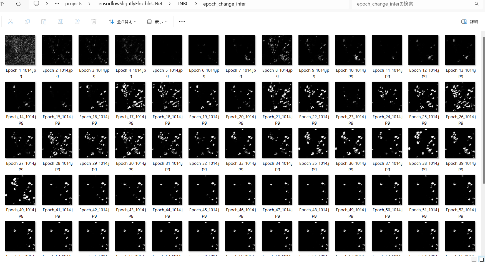  
These inferred masks will be helpful to examine the parameters of the configuration file to get a better model. 
   
The training process has just been stopped at epoch 60 by an early-stopping callback as shown below.  
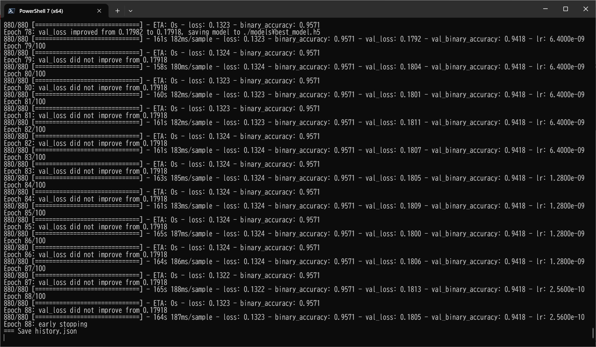 
 
 
<a href="./projects/TensorflowSlightlyFlexibleUNet/TNBC/eval/train_metrics.csv">train_metrics.csv</a> 
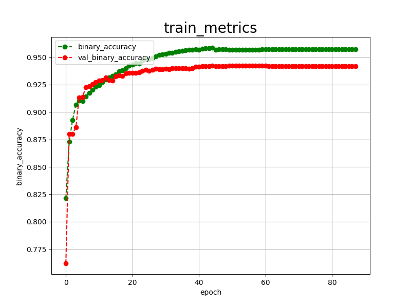 

 
<a href="./projects/TensorflowSlightlyFlexibleUNet/TNBC/eval/train_losses.csv">train_losses.csv</a> 
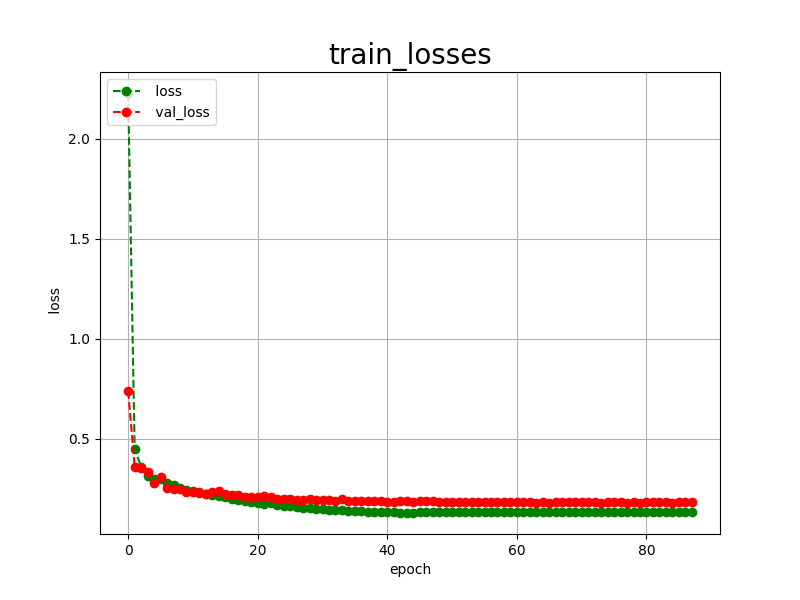 

 

<h3>
5 Evaluation
</h3>
Please move to a <b>./projects/TensorflowSlightlyFlexibleUNet/TNBC</b> folder, 
and run the following bat file to evaluate TensorflowUNet model for TNBC. 
<pre>
./2.evaluate.bat
</pre>
<pre>
python ../../../src/TensorflowUNetEvaluator.py ./train_eval_infer_aug.config
</pre>
Evaluation console output: 
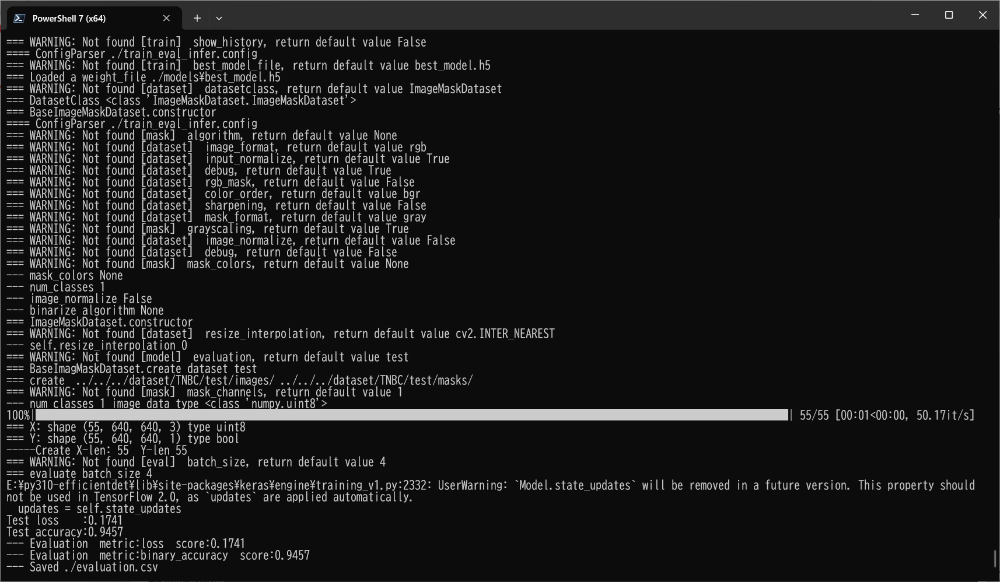
  
<a href="./projects/TensorflowSlightlyFlexibleUNet/TNBC/evaluation.csv">evaluation.csv</a> 
The loss (bce_dice_loss) score for this test dataset is not so low as shown below. 
<pre>
loss,0.1741
binary_accuracy,0.9457
</pre>

 
<h3>
6 Inference
</h3>
Please move to a <b>./projects/TensorflowSlightlyFlexibleUNet/TNBC</b> folder
, and run the following bat file to infer segmentation regions for the images 
in <a href="./projects/TensorflowSlightlyFlexibleUNet/TNBC/mini_test/images"><b>mini_test/images</b></a> by the Trained-TensorflowUNet model for TNBC. 
<pre>
./3.infer.bat
</pre>
<pre>
python ../../../src/TensorflowUNetInferencer.py ./train_eval_infer_aug.config
</pre>

<b>mini_test_images</b> 
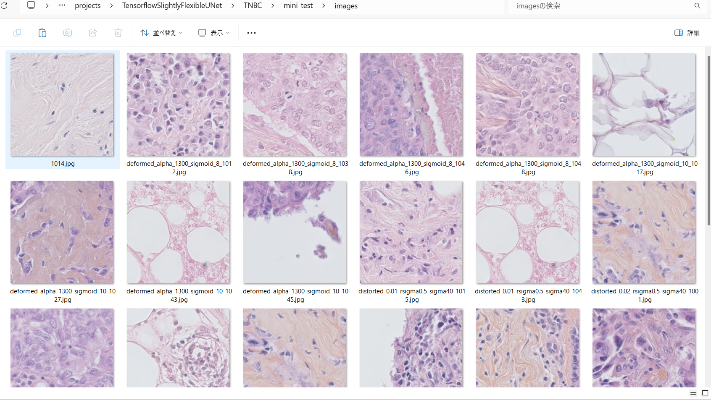 
 
<b>mini_test_mask(ground_truth)</b> 
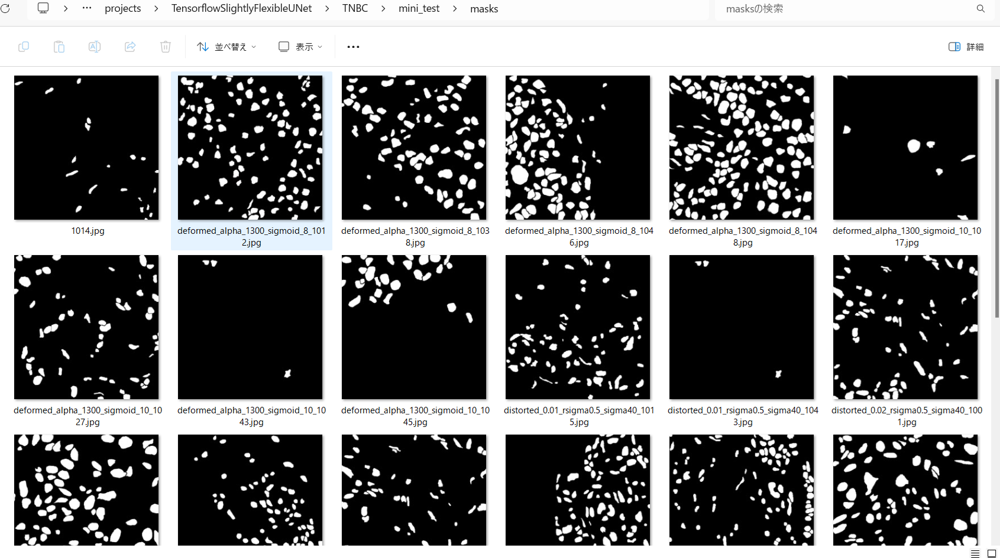 

<b>inferred test masks</b> 
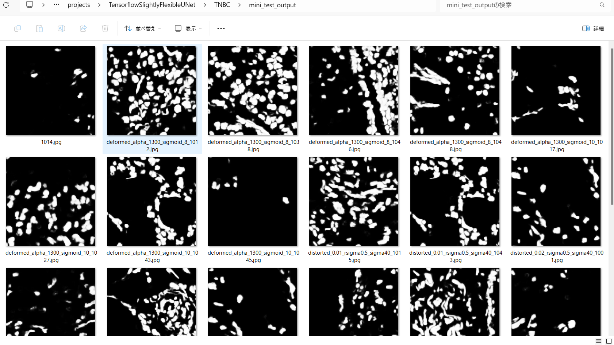 
 
<!--
As shown above, from the prediction on TNBC breast cells, some original annotations (ground truth) might need modification using the prediction results of a trained segmentation model.
-->
 

<b>Enlarged Masks Comparison</b> 

   
<table>
<tr>
<th>Image</th>
<th>Mask (ground_truth)</th>
<th>Inferred-mask</th>
</tr>

<tr>
<td></td>
<td></td>
<td></td>
</tr>

<tr>
<td>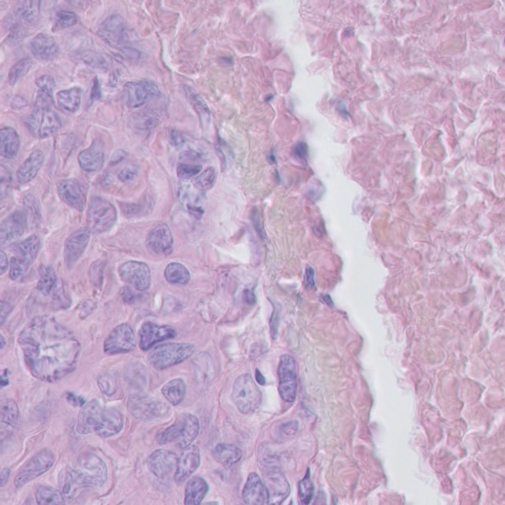</td>
<td>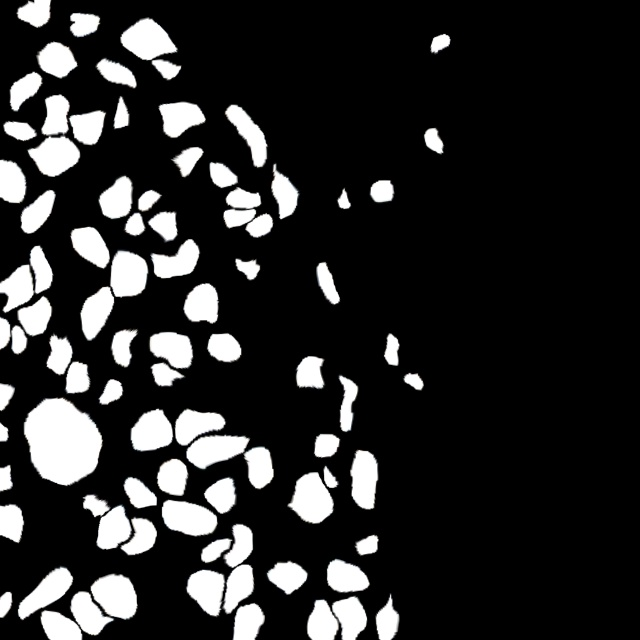</td>
<td>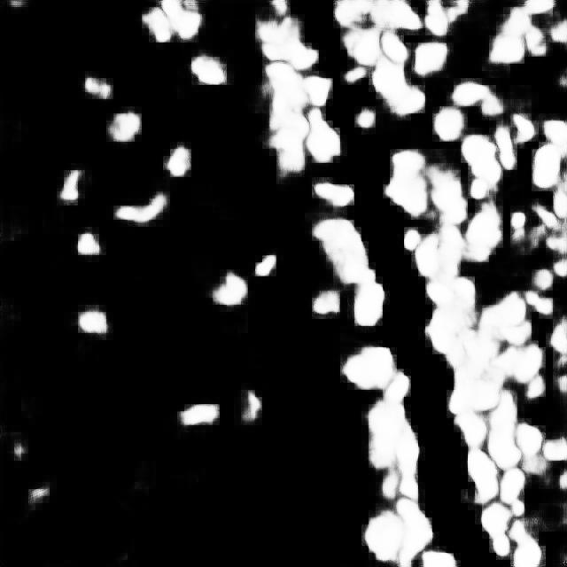</td>
</tr>

<tr>
<td></td>
<td></td>
<td></td>
</tr>

<tr>
<td>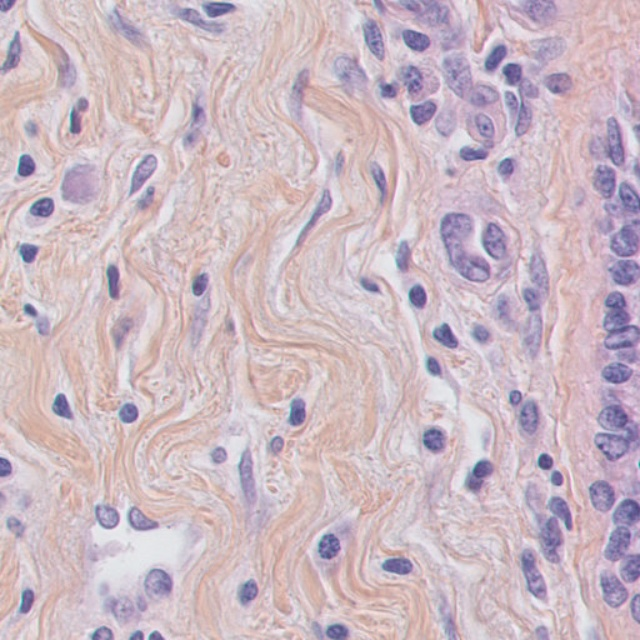</td>
<td>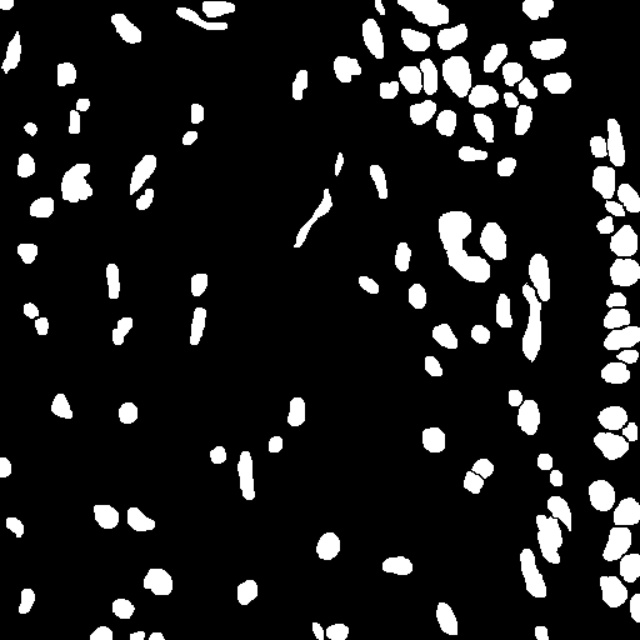</td>
<td>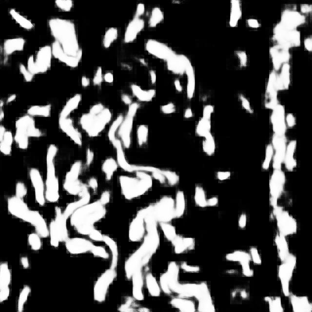</td>
</tr>

<tr>
<td>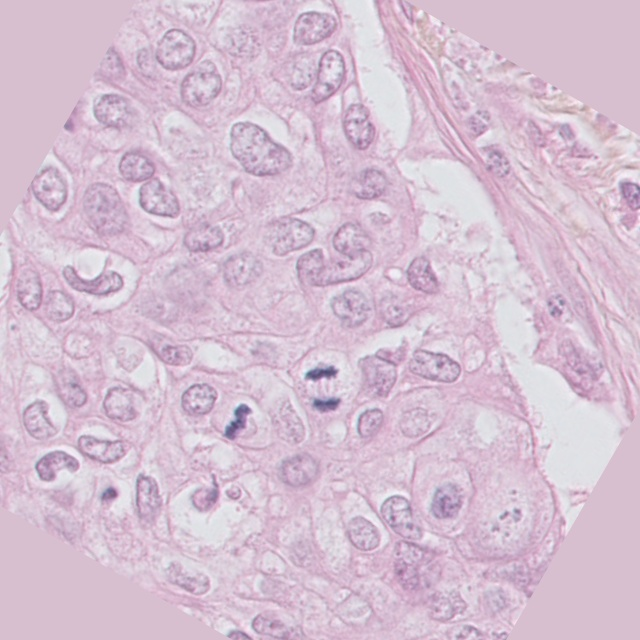</td>
<td>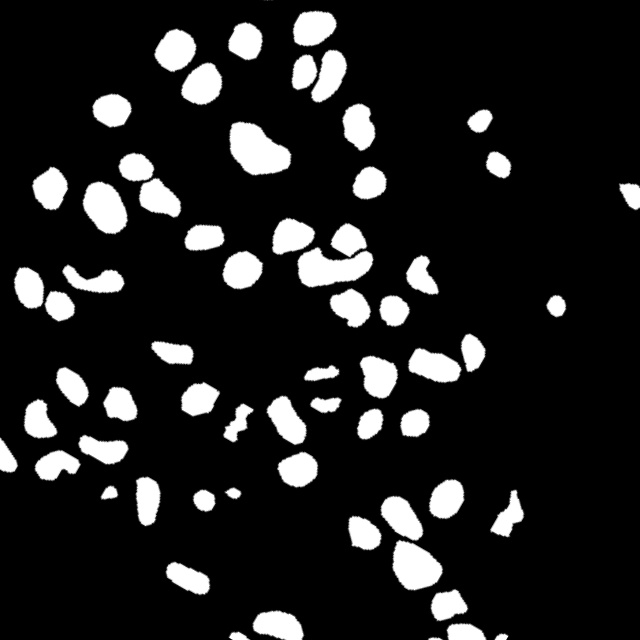</td>
<td>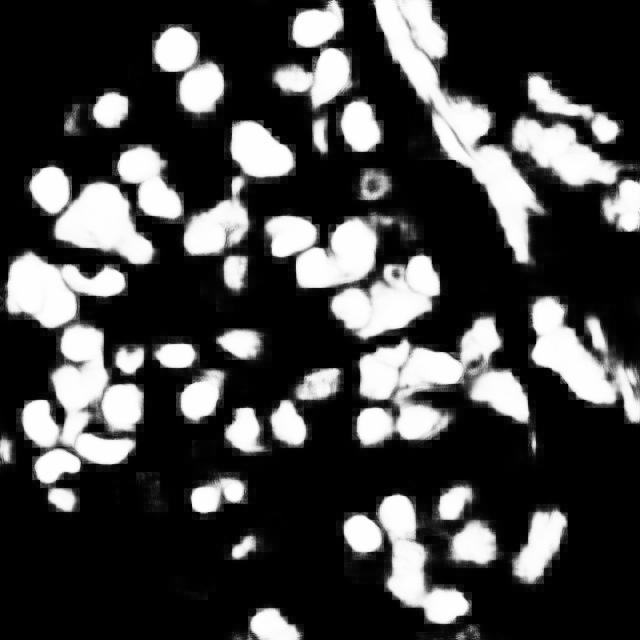</td>
</tr>
</table>
 

<h3>
References
</h3>
<b>1. Triple negative breast cancer: Pitfalls and progress</b> 
npj Breast Cancer volume 8, Article number: 95 (2022)  
Paola Zagami & Lisa Anne Carey 
<pre>
https://www.nature.com/articles/s41523-022-00468-0
</pre>

 
<b>2. A Large-scale Synthetic Pathological Dataset for Deep Learning-enabled  
Segmentation of Breast Cancer</b> 
Scientific Data volume 10, Article number: 231 (2023)  
Kexin Ding, Mu Zhou, He Wang, Olivier Gevaert, Dimitris Metaxas & Shaoting Zhang 
<pre>
https://www.nature.com/articles/s41597-023-02125-y
</pre>
 
<b>3. A review and comparison of breast tumor cell nuclei segmentation performances 
 using deep convolutional neural networks</b> 
 Scientific Reports volume 11, Article number: 8025 (2021)  
 Andrew Lagree, Majidreza Mohebpour, Nicholas Meti, Khadijeh Saednia, Fang-I. Lu, 
Elzbieta Slodkowska, Sonal Gandhi, Eileen Rakovitch, Alex Shenfield,  
Ali Sadeghi-Naini & William T. Tran 
 
 <pre>
https://www.nature.com/articles/s41598-021-87496-1
</pre>